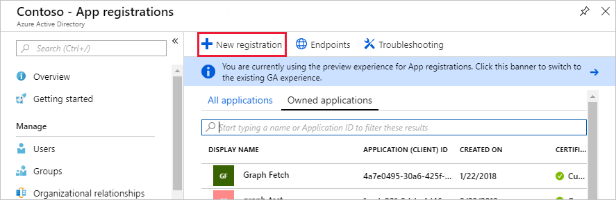
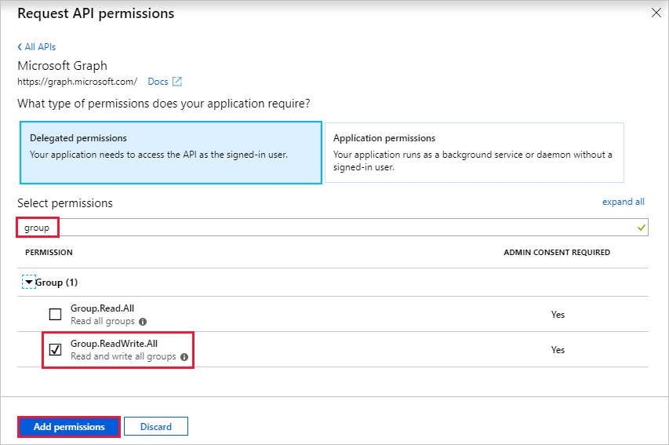
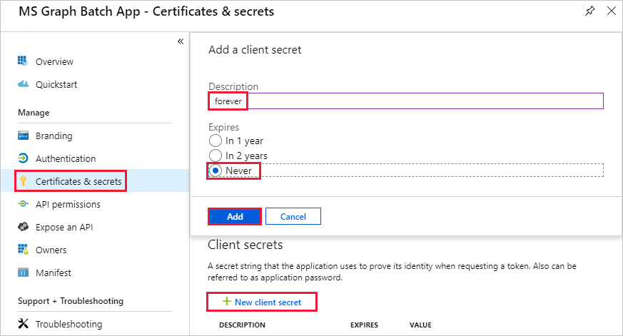

<!-- markdownlint-disable MD002 MD041 -->

En este ejercicio, creará una nueva aplicación de Azure Active Directory que se usará para proporcionar los permisos delegados para el conector personalizado.In this exercise, you will create a new Azure Active Directory Application which will be used to provide the delegated permissions for the custom connector.

Abra un explorador y vaya al [centro de administración de Azure Active Directory](https://aad.portal.azure.com).Open a browser and navigate to [Azure Active Directory admin center](https://aad.portal.azure.com). Elija el vínculo de **Azure Active Directory** en el menú de navegación de la izquierda y, después, elija la entrada **registros de aplicaciones** en la sección **administrar** de la hoja **Azure Active Directory** .Choose the **Azure Active Directory** link in the left navigation menu, then choose the **App registrations** entry in the **Manage** section of the **Azure Active Directory** blade.

Elija el elemento de menú **registro nuevo** en la parte superior de la hoja **registros de aplicaciones** .Choose the **New registration** menu item at the top of the **App Registrations** blade.

Escriba `MS Graph Batch App` en el campo **nombre** .Enter `MS Graph Batch App` in the **Name** field. En la sección **tipos de cuenta admitidos** , seleccione **cuentas en cualquier directorio de la organización**.In the **Supported account types** section, select **Accounts in any organizational directory**. Deje en blanco la sección **URI de redireccionamiento** y elija **registrar**.Leave the **Redirect URI** section blank and choose **Register**.

En la hoja **aplicación para lotes de MS Graph** , copie el identificador de la **aplicación (cliente)**.On the **MS Graph Batch App** blade, copy the **Application (client) ID**. Lo necesitará en el siguiente ejercicio.You'll need this in the next exercise.

Elija la entrada **permisos de API** en la sección **administrar** de la hoja **aplicación por lotes de MS Graph** .Choose the **API permissions** entry in the **Manage** section of the **MS Graph Batch App** blade. Elija **Agregar un permiso** en **permisos** de la API.Choose **Add a permission** under **API permissions**.

En la hoja **solicitar permisos de API** , elija **Microsoft Graph** y, a continuación, elija **permisos delegados**.In the **Request API permissions** blade, choose the **Microsoft Graph** , then choose **Delegated permissions**. Busque `group` y, a continuación, seleccione el permiso delegados **leer y escribir en todos los grupos** .Search for `group`, then select the **Read and write all groups** delegated permission. Elija **Agregar permisos** en la parte inferior de la hoja.Choose **Add permissions** at the bottom of the blade.

 

Elija la entrada **certificados y secretos** en la sección **administrar** de la hoja de la **aplicación batch de MS Graph** y, a continuación, elija **nuevo secreto de cliente**.Choose the **Certificates and secrets** entry in the **Manage** section of the **MS Graph Batch App** blade, then choose **New client secret**. Escriba `forever` en la **Descripción** y seleccione **nunca** en **Expires**.Enter `forever` in the **Description** and select **Never** under **Expires**. Seleccione **Agregar**.Choose **Add**.

Copie el valor del nuevo secreto.Copy the value for the new secret. Lo necesitará en el siguiente ejercicio.You'll need this in the next exercise.

> [!IMPORTANT]
> Este paso es fundamental ya que no se podrá acceder al secreto una vez que cierre esta hoja.This step is critical as the secret will not be accessible once you close this blade. Guarde este secreto en un editor de texto para usarlo en los ejercicios venideros.Save this secret to a text editor for use in upcoming exercises.

Para habilitar la administración de servicios adicionales a los que se puede tener acceso a través de Microsoft Graph, incluidas las propiedades de Team, debe seleccionar ámbitos apropiados adicionales para habilitar la administración de servicios específicos.To enable management of additional services accessible via the Microsoft Graph, including Teams properties, you would need to select additional, appropriate scopes to enable managing specific services. Por ejemplo, para ampliar nuestra solución para habilitar la creación de blocs de notas de OneNote o los planes de planeación, las tareas que necesitaría agregar los ámbitos de permisos necesarios para las API relevantes.For example, to extend our solution to enable creating OneNote Notebooks or Planner plans, buckets and tasks you would need to add the required permission scopes for the relevant APIs.
