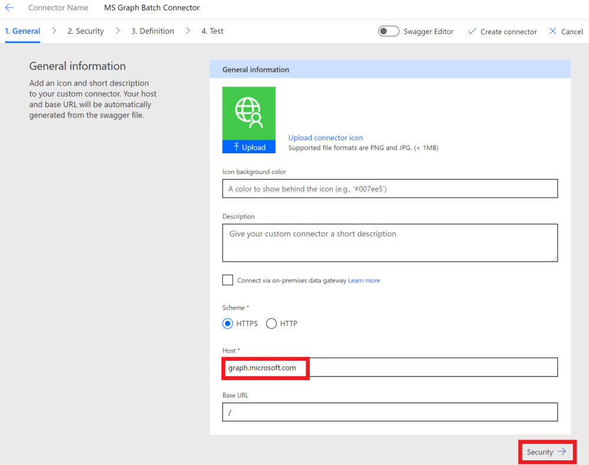

<!-- markdownlint-disable MD002 MD041 -->

En este ejercicio, creará un nuevo conector personalizado que se puede usar en Microsoft Power Automate o en las aplicaciones lógicas de Azure.In this exercise, you will create a new custom connector which can be used in Microsoft Power Automate or in Azure Logic Apps. El archivo de definición de OpenAPI está precompilado con la ruta de acceso correcta para el punto de conexión de Microsoft Graph `$batch` y la configuración adicional para habilitar la importación simple.The OpenAPI definition file is prebuilt with the correct path for the Microsoft Graph `$batch` endpoint and additional settings to enable simple import.

Hay dos opciones para crear un conector personalizado para Microsoft Graph:There are two options to create a custom connector for Microsoft Graph:

- Crear a partir de blancoCreate from blank
- Importar un archivo OpenAPIImport an OpenAPI file

## Opción 1: crear un conector personalizado a partir de una plantilla en blancoOption 1: Create custom connector from blank template

Abra un explorador y navegue a [Microsoft Power Automate](https://flow.microsoft.com).Open a browser and navigate to [Microsoft Power Automate](https://flow.microsoft.com). Inicie sesión con su cuenta de administrador de inquilinos de Office 365.Sign in with your Office 365 tenant administrator account. Elija **datos** en el menú de la parte izquierda y seleccione el elemento **conectores personalizados** en el menú desplegable.Choose **Data** on the left-hand side menu, and select the **Custom Connectors** item in the drop-down menu.

En la página **conectores personalizados** , elija el vínculo **nuevo conector personalizado** en la parte superior derecha y, a continuación, seleccione el elemento **crear desde en blanco** en el menú desplegable.On the **Custom Connectors** page choose the **New custom connector** link in the top right, then select the **Create from blank** item in the drop-down menu.

Escriba `MS Graph Batch Connector` en el cuadro de texto **nombre del conector** .Enter `MS Graph Batch Connector` in the **Connector name** text box. Choose **Continue**.Choose **Continue**.

En la página configuración **General** del conector, rellene los campos como se indica a continuación.On the connector configuration **General** page, fill in the fields as follows.

- **Esquema** : https**Scheme** : HTTPS
- **Host** : `graph.microsoft.com`**Host** : `graph.microsoft.com`
- **Dirección URL base** : `/`**Base URL** : `/`

Elija el botón **seguridad** para continuar.Choose **Security** button to continue.

En la página **seguridad** , rellene los campos como se indica a continuación.On the **Security** page, fill in the fields as follows.

- **Elija qué autenticación implementa la API** : `OAuth 2.0`**Choose what authentication is implemented by your API** : `OAuth 2.0`
- **Proveedor de identidad** : `Azure Active Directory`**Identity Provider** : `Azure Active Directory`
- **Identificador de cliente** : identificador de la aplicación que creó en el ejercicio anterior.**Client id** : the application ID you created in the previous exercise
- **Secreto de cliente** : la clave que creó en el ejercicio anterior**Client secret** : the key you created in the previous exercise
- **Dirección URL de inicio de sesión** : `https://login.windows.net`**Login url** : `https://login.windows.net`
- **Identificador de inquilino** : `common`**Tenant ID** : `common`
- **Dirección URL del recurso** : `https://graph.microsoft.com` (sin finalización/)**Resource URL** : `https://graph.microsoft.com` (no trailing /)
- **Ámbito** : dejar en blanco**Scope** : Leave blank

Elija el botón **definición** para continuar.Choose **Definition** button to continue.

En la página **definición** , seleccione **nueva acción** y rellene los campos de la siguiente manera.On the **Definition** page, select **New Action** and fill in the fields as follows.

- **Resumen** : `Batch`**Summary** : `Batch`
- **Descripción** : `Execute Batch with Delegate Permission`**Description** : `Execute Batch with Delegate Permission`
- **Identificador de operación** : `Batch`**Operation ID** : `Batch`
- **Visibilidad** : `important`**Visibility** : `important`

Para crear una **solicitud** , seleccione **Importar desde ejemplo** y rellene los campos como se indica a continuación.Create **Request** by selecting **Import from Sample** and fill in the fields as follows.

- **Verbo** : `POST`**Verb** : `POST`
- **URL** : `https://graph.microsoft.com/v1.0/$batch`**URL** : `https://graph.microsoft.com/v1.0/$batch`
- **Encabezados** : dejar en blanco**Headers** : Leave blank
- **Cuerpo** : `{}`**Body** : `{}`

Seleccione **Importar**.Select **Import**.

Elija **crear conector** en la parte superior derecha.Choose **Create Connector** on the top-right. Una vez creado el conector, copie la **dirección URL de redireccionamiento** generada desde la página **seguridad** .After the connector has been created, copy the generated **Redirect URL** from **Security** page.

Vuelva a la aplicación registrada en el [portal de Azure](https://aad.portal.azure.com) que creó en el ejercicio anterior.Go back to the registered application in the [Azure Portal](https://aad.portal.azure.com) you created in the previous exercise. Seleccione **autenticación** en el menú de la parte izquierda.Select **Authentication** on the left-hand side menu. Seleccione **Agregar una plataforma** y, a continuación, seleccione **Web**.Select **Add a platform** , then select **Web**. Escriba la dirección URL de redireccionamiento copiada del paso anterior en los **URI de redireccionamiento** y, después, seleccione **configurar**.Enter the redirect URL copied from the previous step in the **Redirect URIs** , then select **Configure**.

## Opción 2: crear un conector personalizado mediante la importación del archivo OpenAPIOption 2: Create custom connector by importing OpenAPI file

Con un editor de texto, cree un nuevo archivo vacío denominado `MSGraph-Delegate-Batch.swagger.json` y agregue el siguiente código.Using a text editor, create a new empty file named `MSGraph-Delegate-Batch.swagger.json` and add the following code.

[!code-json]

Abra un explorador y navegue a [Microsoft Power Automate](https://flow.microsoft.com).Open a browser and navigate to [Microsoft Power Automate](https://flow.microsoft.com). Inicie sesión con su cuenta de administrador de inquilinos de Office 365.Sign in with your Office 365 tenant administrator account. Elija **datos** en el menú de la parte izquierda y seleccione el elemento **conectores personalizados** en el menú desplegable.Choose **Data** on the left-hand side menu, and select the **Custom Connectors** item in the drop-down menu.

En la página **conectores personalizados** , elija el vínculo **nuevo conector personalizado** en la parte superior derecha y, a continuación, seleccione el elemento **importar un archivo de OpenAPI** en el menú desplegable.On the **Custom Connectors** page choose the **New custom connector** link in the top right, then select the **Import an OpenAPI file** item in the drop-down menu.

Escriba `MS Graph Batch Connector` en el cuadro de texto **nombre del conector** .Enter `MS Graph Batch Connector` in the **Connector name** text box. Elija el icono de carpeta para cargar el archivo OpenAPI.Choose the folder icon to upload the OpenAPI file. Busque el `MSGraph-Delegate-Batch.swagger.json` archivo que ha creado.Browse to the `MSGraph-Delegate-Batch.swagger.json` file you created. Elija **continuar** para cargar el archivo OpenAPI.Choose **Continue** to upload the OpenAPI file.

En la página Configuración del conector, elija el vínculo **seguridad** en el menú de navegación.On the connector configuration page, choose the **Security** link in the navigation menu. Rellene los campos como se indica a continuación.Fill in the fields as follows.

- **Elija qué autenticación implementa la API** : `OAuth 2.0`**Choose what authentication is implemented by your API** : `OAuth 2.0`
- **Proveedor de identidad** : `Azure Active Directory`**Identity Provider** : `Azure Active Directory`
- **Identificador de cliente** : identificador de la aplicación que creó en el ejercicio anterior.**Client id** : the application ID you created in the previous exercise
- **Secreto de cliente** : la clave que creó en el ejercicio anterior**Client secret** : the key you created in the previous exercise
- **Dirección URL de inicio de sesión** : `https://login.windows.net`**Login url** : `https://login.windows.net`
- **Identificador de inquilino** : `common`**Tenant ID** : `common`
- **Dirección URL del recurso** : `https://graph.microsoft.com` (sin finalización/)**Resource URL** : `https://graph.microsoft.com` (no trailing /)
- **Ámbito** : dejar en blanco**Scope** : Leave blank

Elija **crear conector** en la parte superior derecha.Choose **Create Connector** on the top-right. Una vez creado el conector, copie la **dirección URL de redireccionamiento** generada.After the connector has been created, copy the generated **Redirect URL**.

Vuelva a la aplicación registrada en el [portal de Azure](https://aad.portal.azure.com) que creó en el ejercicio anterior.Go back to the registered application in the [Azure Portal](https://aad.portal.azure.com) you created in the previous exercise. Seleccione **autenticación** en el menú de la parte izquierda.Select **Authentication** on the left-hand side menu. Seleccione **Agregar una plataforma** y, a continuación, seleccione **Web**.Select **Add a platform** , then select **Web**. Escriba la dirección URL de redireccionamiento copiada del paso anterior en los **URI de redireccionamiento** y, después, seleccione **configurar**.Enter the redirect URL copied from the previous step in the **Redirect URIs** , then select **Configure**.

