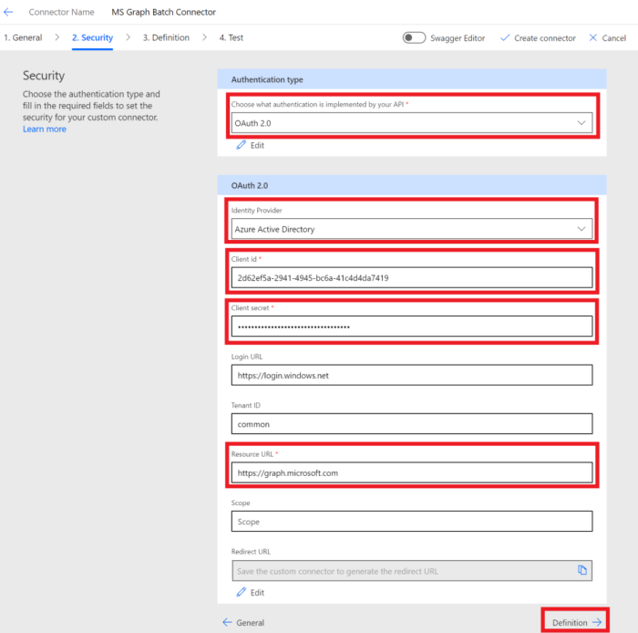

<!-- markdownlint-disable MD002 MD041 -->

En este ejercicio, creará un nuevo conector personalizado que se puede usar en Microsoft Power Automate o en las aplicaciones lógicas de Azure. El archivo de definición de OpenAPI está precompilado con la ruta de acceso correcta para el punto de conexión de Microsoft Graph `$batch` y la configuración adicional para habilitar la importación simple.

Hay dos opciones para crear un conector personalizado para Microsoft Graph:

- Crear a partir de blanco
- Importar un archivo OpenAPI

## Opción 1: crear un conector personalizado a partir de una plantilla en blanco

Abra un explorador y navegue a [Microsoft Power Automate](https://flow.microsoft.com). Inicie sesión con su cuenta de administrador de inquilinos de Office 365. Elija **datos** en el menú de la parte izquierda y seleccione el elemento **conectores personalizados** en el menú desplegable.

En la página **conectores personalizados** , elija el vínculo **nuevo conector personalizado** en la parte superior derecha y, a continuación, seleccione el elemento **crear desde en blanco** en el menú desplegable.

Escriba `MS Graph Batch Connector` en el cuadro de texto **nombre del conector** . Choose **Continue**.

En la página configuración **General** del conector, rellene los campos como se indica a continuación.

- **Esquema** : https
- **Host** : `graph.microsoft.com`
- **Dirección URL base** : `/`

Elija el botón **seguridad** para continuar.

En la página **seguridad** , rellene los campos como se indica a continuación.

- **Elija qué autenticación implementa la API** : `OAuth 2.0`
- **Proveedor de identidad** : `Azure Active Directory`
- **Identificador de cliente** : identificador de la aplicación que creó en el ejercicio anterior.
- **Secreto de cliente** : la clave que creó en el ejercicio anterior
- **Dirección URL de inicio de sesión** : `https://login.windows.net`
- **Identificador de inquilino** : `common`
- **Dirección URL del recurso** : `https://graph.microsoft.com` (sin finalización/)
- **Ámbito** : dejar en blanco

Elija el botón **definición** para continuar.

En la página **definición** , seleccione **nueva acción** y rellene los campos de la siguiente manera.

- **Resumen** : `Batch`
- **Descripción** : `Execute Batch with Delegate Permission`
- **Identificador de operación** : `Batch`
- **Visibilidad** : `important`

Para crear una **solicitud** , seleccione **Importar desde ejemplo** y rellene los campos como se indica a continuación.

- **Verbo** : `POST`
- **URL** : `https://graph.microsoft.com/v1.0/$batch`
- **Encabezados** : dejar en blanco
- **Cuerpo** : `{}`

Seleccione **Importar**.

Elija **crear conector** en la parte superior derecha. Una vez creado el conector, copie la **dirección URL de redireccionamiento** generada desde la página **seguridad** .

Vuelva a la aplicación registrada en el [portal de Azure](https://aad.portal.azure.com) que creó en el ejercicio anterior. Seleccione **autenticación** en el menú de la parte izquierda. Seleccione **Agregar una plataforma** y, a continuación, seleccione **Web**. Escriba la dirección URL de redireccionamiento copiada del paso anterior en los **URI de redireccionamiento** y, después, seleccione **configurar**.

## Opción 2: crear un conector personalizado mediante la importación del archivo OpenAPI

Con un editor de texto, cree un nuevo archivo vacío denominado `MSGraph-Delegate-Batch.swagger.json` y agregue el siguiente código.

[!code-json]

Abra un explorador y navegue a [Microsoft Power Automate](https://flow.microsoft.com). Inicie sesión con su cuenta de administrador de inquilinos de Office 365. Elija **datos** en el menú de la parte izquierda y seleccione el elemento **conectores personalizados** en el menú desplegable.

En la página **conectores personalizados** , elija el vínculo **nuevo conector personalizado** en la parte superior derecha y, a continuación, seleccione el elemento **importar un archivo de OpenAPI** en el menú desplegable.

Escriba `MS Graph Batch Connector` en el cuadro de texto **nombre del conector** . Elija el icono de carpeta para cargar el archivo OpenAPI. Busque el `MSGraph-Delegate-Batch.swagger.json` archivo que ha creado. Elija **continuar** para cargar el archivo OpenAPI.

En la página Configuración del conector, elija el vínculo **seguridad** en el menú de navegación. Rellene los campos como se indica a continuación.

- **Elija qué autenticación implementa la API** : `OAuth 2.0`
- **Proveedor de identidad** : `Azure Active Directory`
- **Identificador de cliente** : identificador de la aplicación que creó en el ejercicio anterior.
- **Secreto de cliente** : la clave que creó en el ejercicio anterior
- **Dirección URL de inicio de sesión** : `https://login.windows.net`
- **Identificador de inquilino** : `common`
- **Dirección URL del recurso** : `https://graph.microsoft.com` (sin finalización/)
- **Ámbito** : dejar en blanco

Elija **crear conector** en la parte superior derecha. Una vez creado el conector, copie la **dirección URL de redireccionamiento** generada.

Vuelva a la aplicación registrada en el [portal de Azure](https://aad.portal.azure.com) que creó en el ejercicio anterior. Seleccione **autenticación** en el menú de la parte izquierda. Seleccione **Agregar una plataforma** y, a continuación, seleccione **Web**. Escriba la dirección URL de redireccionamiento copiada del paso anterior en los **URI de redireccionamiento** y, después, seleccione **configurar**.

