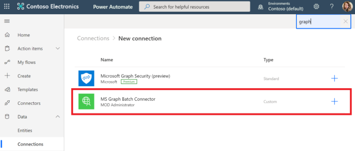

<!-- markdownlint-disable MD002 MD041 -->

El último paso de configuración para asegurarse de que el conector está listo para su uso es autorizar y probar el conector personalizado para crear una conexión en caché.The final configuration step to ensure the connector is ready for use is to authorize and test the custom connector to create a cached connection.

> [!IMPORTANT]
> Los pasos siguientes requieren que haya iniciado sesión con privilegios de administrador.The following steps requires that you are logged in with administrator privileges.

En [Microsoft Power Automate](https://flow.microsoft.com), vaya al elemento de menú **datos** de la izquierda y seleccione la página **conexiones** .In [Microsoft Power Automate](https://flow.microsoft.com), go to the **Data** menu item on the left and choose the **Connections** page. Elija el vínculo **nueva conexión** .Choose the **New Connection** link.

Busque el conector personalizado y complete la conexión haciendo clic en el botón más.Find your custom connector and complete the connection by clicking the plus button. Inicie sesión con su cuenta de Azure Active Directory del administrador de inquilinos de Office 365.Sign in with your Office 365 tenant administrator's Azure Active Directory account.

Cuando se le pidan los permisos solicitados, compruebe el **consentimiento en nombre de su organización** y, después, elija **Aceptar** para autorizar permisos.When prompted for the requested permissions, check **Consent on behalf of your organization** and then choose **Accept** to authorize permissions.

Después de autorizar los permisos, se crea una conexión con Power Automated.After you authorize the permissions, a connection is created in Power Automate.

El conector personalizado ahora está configurado y habilitado.The custom connector is now configured and enabled. Es posible que se produzca un retraso en los permisos aplicados y disponibles, pero el conector ya está configurado.There may be a delay in permissions being applied and available, but the connector is now configured.
