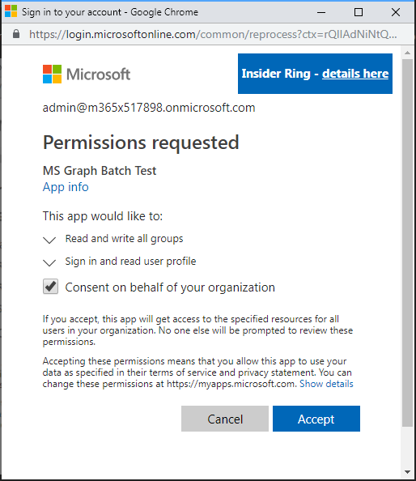

<!-- markdownlint-disable MD002 MD041 -->

El último paso de configuración para asegurarse de que el conector está listo para su uso es autorizar y probar el conector personalizado para crear una conexión en caché.

> [!IMPORTANT]
> Los pasos siguientes requieren que haya iniciado sesión con privilegios de administrador.

En [Microsoft Power Automate](https://flow.microsoft.com), vaya al elemento de menú **datos** de la izquierda y seleccione la página **conexiones** . Elija el vínculo **nueva conexión** .

Busque el conector personalizado y complete la conexión haciendo clic en el botón más. Inicie sesión con su cuenta de Azure Active Directory del administrador de inquilinos de Office 365.

Cuando se le pidan los permisos solicitados, compruebe el **consentimiento en nombre de su organización** y, después, elija **Aceptar** para autorizar permisos.

Después de autorizar los permisos, se crea una conexión con Power Automated.

El conector personalizado ahora está configurado y habilitado. Es posible que se produzca un retraso en los permisos aplicados y disponibles, pero el conector ya está configurado.
