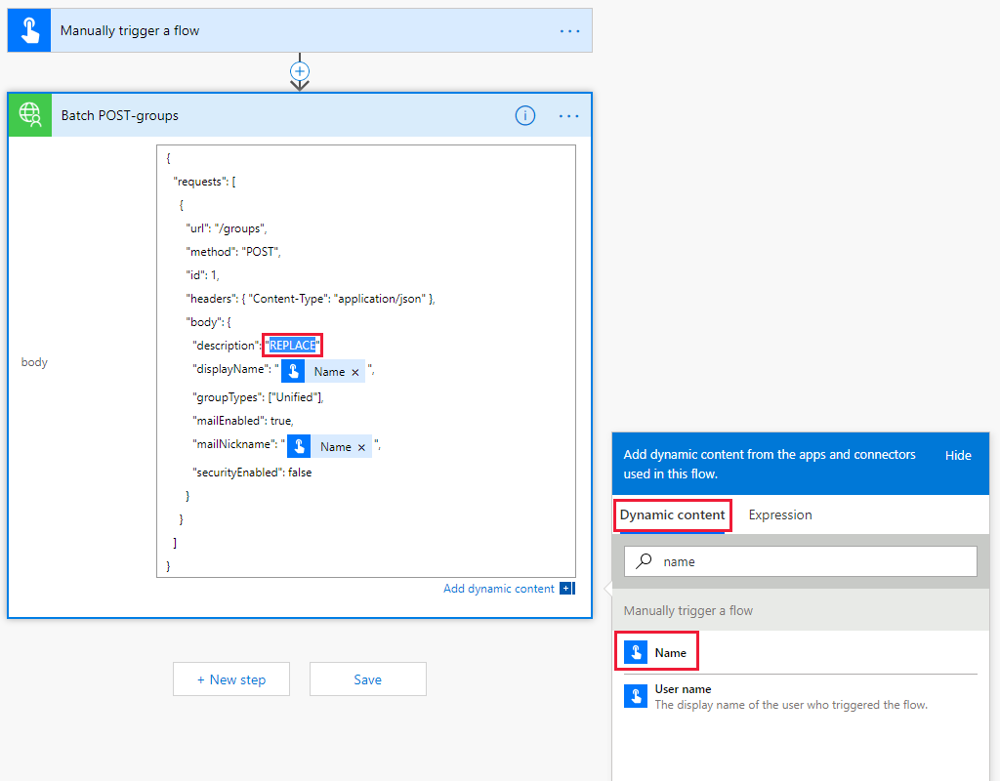

<!-- markdownlint-disable MD002 MD041 -->

<span data-ttu-id="6a76b-101">En este ejercicio, creará un flujo para usar el conector personalizado que creó en los ejercicios anteriores para crear y configurar un equipo de Microsoft.</span><span class="sxs-lookup"><span data-stu-id="6a76b-101">In this exercise, you will create a flow to use the custom connector you created in previous exercises to create and configure a Microsoft Team.</span></span> <span data-ttu-id="6a76b-102">El flujo usará el conector personalizado para enviar una solicitud POST para crear un Grupo Unificado de Office 365, pausará un retraso mientras se completa la creación del grupo y enviará una solicitud PUT para asociar el grupo con un equipo de Microsoft.</span><span class="sxs-lookup"><span data-stu-id="6a76b-102">The flow will use the custom connector to send a POST request to create an Office 365 Unified Group, will pause for a delay while the group creation completes, and then will send a PUT request to associate the group with a Microsoft Team.</span></span>

<span data-ttu-id="6a76b-103">En el final el flujo tendrá un aspecto similar al de la siguiente imagen:</span><span class="sxs-lookup"><span data-stu-id="6a76b-103">In the end your flow will look similar to the following image:</span></span>


<span data-ttu-id="6a76b-105">Abra [Microsoft Power automatizada](https://flow.microsoft.com) en el explorador e inicie sesión con su cuenta de administrador de inquilinos de Office 365.</span><span class="sxs-lookup"><span data-stu-id="6a76b-105">Open [Microsoft Power Automate](https://flow.microsoft.com) in your browser and sign in with your Office 365 tenant administrator account.</span></span> <span data-ttu-id="6a76b-106">Elija **Mis flujos** en el panel de navegación izquierdo.</span><span class="sxs-lookup"><span data-stu-id="6a76b-106">Choose **My flows** in the left-hand navigation.</span></span> <span data-ttu-id="6a76b-107">Elija **nuevo** y luego **instantánea--en blanco**.</span><span class="sxs-lookup"><span data-stu-id="6a76b-107">Choose **New** , then **Instant--from blank**.</span></span> <span data-ttu-id="6a76b-108">Escriba `Create Team` para **nombre de flujo** y, a continuación, seleccione **desencadenar manualmente un flujo** en **elegir cómo activar este flujo**.</span><span class="sxs-lookup"><span data-stu-id="6a76b-108">Enter `Create Team` for **Flow name** , then select **Manually trigger a flow** under **Choose how to trigger this flow**.</span></span> <span data-ttu-id="6a76b-109">Seleccione **Crear**.</span><span class="sxs-lookup"><span data-stu-id="6a76b-109">Choose **Create**.</span></span>

<span data-ttu-id="6a76b-110">Seleccione **desencadenar manualmente un** elemento de flujo y, a continuación, elija **Agregar una entrada** , seleccione **texto** y escriba `Name` como título.</span><span class="sxs-lookup"><span data-stu-id="6a76b-110">Select the **Manually trigger a flow** item, then choose **Add an input** , select **Text** and enter `Name` as the title.</span></span>


<span data-ttu-id="6a76b-112">Elija **nuevo paso** y escriba `Batch` en el cuadro de búsqueda.</span><span class="sxs-lookup"><span data-stu-id="6a76b-112">Choose **New step** and type `Batch` in the search box.</span></span> <span data-ttu-id="6a76b-113">Agregue la acción **conector por lotes de MS Graph** .</span><span class="sxs-lookup"><span data-stu-id="6a76b-113">Add the **MS Graph Batch Connector** action.</span></span> <span data-ttu-id="6a76b-114">Elija los puntos suspensivos y cambie el nombre de esta acción a `Batch POST-groups` .</span><span class="sxs-lookup"><span data-stu-id="6a76b-114">Choose the ellipsis and rename this action to `Batch POST-groups`.</span></span>

<span data-ttu-id="6a76b-115">Agregue el código siguiente en el cuadro de texto **Body** de la acción.</span><span class="sxs-lookup"><span data-stu-id="6a76b-115">Add the following code into the **body** text box of the action.</span></span>

```json
{
  "requests": [
    {
      "url": "/groups",
      "method": "POST",
      "id": 1,
      "headers": { "Content-Type": "application/json" },
      "body": {
        "description": "REPLACE",
        "displayName": "REPLACE",
        "groupTypes": ["Unified"],
        "mailEnabled": true,
        "mailNickname": "REPLACE",
        "securityEnabled": false
      }
    }
  ]
}
```

<span data-ttu-id="6a76b-116">Reemplace cada `REPLACE` marcador de posición seleccionando el `Name` valor en el desencadenador manual del menú **agregar contenido dinámico** .</span><span class="sxs-lookup"><span data-stu-id="6a76b-116">Replace each `REPLACE` placeholder by selecting the `Name` value from the manual trigger from the **Add dynamic content** menu.</span></span>



<span data-ttu-id="6a76b-118">Elija **nuevo paso** , busque `delay` y agregue una acción de **retraso** y configure por 1 minuto.</span><span class="sxs-lookup"><span data-stu-id="6a76b-118">Choose **New step** , search for `delay` and add a **Delay** action and configure for 1 minute.</span></span>

<span data-ttu-id="6a76b-119">Elija **nuevo paso** y escriba `Batch` en el cuadro de búsqueda.</span><span class="sxs-lookup"><span data-stu-id="6a76b-119">Choose **New step** and type `Batch` in the search box.</span></span> <span data-ttu-id="6a76b-120">Agregue la acción **conector por lotes de MS Graph** .</span><span class="sxs-lookup"><span data-stu-id="6a76b-120">Add the **MS Graph Batch Connector** action.</span></span> <span data-ttu-id="6a76b-121">Elija los puntos suspensivos y cambie el nombre de esta acción a `Batch PUT-team` .</span><span class="sxs-lookup"><span data-stu-id="6a76b-121">Choose the ellipsis and rename this action to `Batch PUT-team`.</span></span>

<span data-ttu-id="6a76b-122">Agregue el código siguiente en el cuadro de texto **Body** de la acción.</span><span class="sxs-lookup"><span data-stu-id="6a76b-122">Add the following code into the **body** text box of the action.</span></span>

```json
{
  "requests": [
    {
      "id": 1,
      "url": "/groups/REPLACE/team",
      "method": "PUT",
      "headers": {
        "Content-Type": "application/json"
      },
      "body": {
        "memberSettings": {
          "allowCreateUpdateChannels": true
        },
        "messagingSettings": {
          "allowUserEditMessages": true,
          "allowUserDeleteMessages": true
        },
        "funSettings": {
          "allowGiphy": true,
          "giphyContentRating": "strict"
        }
      }
    }
  ]
}
```

<span data-ttu-id="6a76b-123">Seleccione el `REPLACE` marcador de posición y, a continuación, seleccione **expresión** en el panel contenido dinámico.</span><span class="sxs-lookup"><span data-stu-id="6a76b-123">Select the `REPLACE` placeholder, then select **Expression** in the dynamic content pane.</span></span> <span data-ttu-id="6a76b-124">Agregue la fórmula siguiente a la **expresión**.</span><span class="sxs-lookup"><span data-stu-id="6a76b-124">Add the following formula into the **Expression**.</span></span>

```js
body('Batch_POST-groups').responses[0].body.id
```


<span data-ttu-id="6a76b-126">Esta fórmula especifica que queremos usar el identificador de grupo del resultado de la primera acción.</span><span class="sxs-lookup"><span data-stu-id="6a76b-126">This formula specifies that we want to use the group ID from the result of the first action.</span></span>


<span data-ttu-id="6a76b-128">Elija **Guardar** y, a continuación, elija **prueba** para ejecutar el flujo.</span><span class="sxs-lookup"><span data-stu-id="6a76b-128">Choose **Save** , then choose **Test** to execute the flow.</span></span>

> [!TIP]
> <span data-ttu-id="6a76b-129">Si recibe un error como `The template validation failed: 'The action(s) 'Batch_POST-groups' referenced by 'inputs' in action 'Batch_2' are not defined in the template'` el siguiente, la expresión es incorrecta y es probable que haga referencia a una acción de flujo que no puede encontrar.</span><span class="sxs-lookup"><span data-stu-id="6a76b-129">If you receive an error like `The template validation failed: 'The action(s) 'Batch_POST-groups' referenced by 'inputs' in action 'Batch_2' are not defined in the template'`, the expression is incorrect and likely references a flow action it cannot find.</span></span> <span data-ttu-id="6a76b-130">Asegúrese de que el nombre de la acción al que hace referencia coincide exactamente.</span><span class="sxs-lookup"><span data-stu-id="6a76b-130">Ensure that the action name you are referencing matches exactly.</span></span>

<span data-ttu-id="6a76b-131">Elija el botón de opción **voy a realizar la acción desencadenadora** y elija **Guardar & prueba**.</span><span class="sxs-lookup"><span data-stu-id="6a76b-131">Choose the **I'll perform the trigger** action radio button and choose **Save & Test**.</span></span> <span data-ttu-id="6a76b-132">Elija **continuar** en el cuadro de diálogo.</span><span class="sxs-lookup"><span data-stu-id="6a76b-132">Choose **Continue** in the dialog.</span></span> <span data-ttu-id="6a76b-133">Proporcione un nombre sin espacios y elija **Ejecutar flujo** para crear un equipo.</span><span class="sxs-lookup"><span data-stu-id="6a76b-133">Provide a name without spaces, and choose **Run flow** to create a Team.</span></span>


<span data-ttu-id="6a76b-135">Por último, elija el **listo** para ver el registro de actividades.</span><span class="sxs-lookup"><span data-stu-id="6a76b-135">Finally, choose the **Done** to see the activity log.</span></span> <span data-ttu-id="6a76b-136">Una vez que se haya completado el flujo, el grupo y el equipo de 365 de Office se han configurado.</span><span class="sxs-lookup"><span data-stu-id="6a76b-136">Once the flow completes, your Office 365 Group and Team have been configured.</span></span> <span data-ttu-id="6a76b-137">Seleccione los elementos de acción por lotes para ver los resultados de las llamadas de lotes JSON.</span><span class="sxs-lookup"><span data-stu-id="6a76b-137">Select the Batch action items to view the results of the JSON Batch calls.</span></span> <span data-ttu-id="6a76b-138">La `outputs` de la `Batch PUT-team` acción debe tener un código de estado de 201 para una asociación de equipo correcta similar a la imagen siguiente.</span><span class="sxs-lookup"><span data-stu-id="6a76b-138">The `outputs` of the `Batch PUT-team` action should have a status code of 201 for a successful Team association similar to the image below.</span></span>


