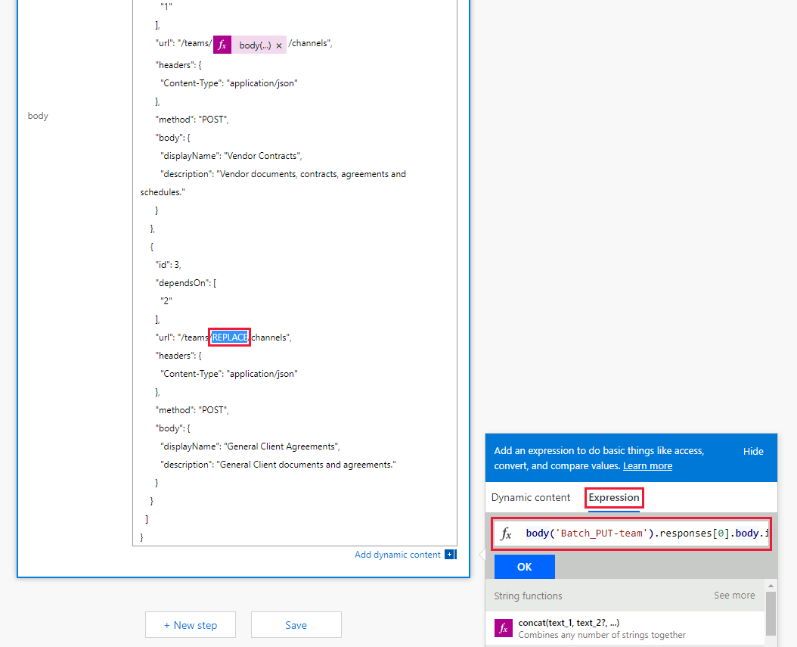

<!-- markdownlint-disable MD002 MD041 -->

<span data-ttu-id="2b9ef-101">El flujo que ha creado en el ejercicio anterior usa la `$batch` API para realizar dos solicitudes individuales a Microsoft Graph.</span><span class="sxs-lookup"><span data-stu-id="2b9ef-101">The Flow you created in the previous exercise uses the `$batch` API to make two individual requests to the Microsoft Graph.</span></span> <span data-ttu-id="2b9ef-102">La llamada al `$batch` punto de conexión de esta forma proporciona alguna ventaja y flexibilidad, pero la verdadera potencia del `$batch` punto de conexión viene cuando ejecuta varias solicitudes a Microsoft Graph en una sola `$batch` llamada.</span><span class="sxs-lookup"><span data-stu-id="2b9ef-102">Calling the `$batch` endpoint this way provides some benefit and flexibility, but the true power of the `$batch` endpoint comes when executing multiple requests to Microsoft Graph in a single `$batch` call.</span></span> <span data-ttu-id="2b9ef-103">En este ejercicio, ampliará el ejemplo de creación de un grupo unificado y asociando un equipo para incluir la creación de varios canales predeterminados para el equipo en una sola `$batch` solicitud.</span><span class="sxs-lookup"><span data-stu-id="2b9ef-103">In this exercise, you will extend the example of creating a Unified Group and associating a Team to include creating multiple default Channels for the Team in a single `$batch` request.</span></span>

<span data-ttu-id="2b9ef-104">Abra [Microsoft Power automatizada](https://flow.microsoft.com) en el explorador e inicie sesión con su cuenta de administrador de inquilinos de Office 365.</span><span class="sxs-lookup"><span data-stu-id="2b9ef-104">Open [Microsoft Power Automate](https://flow.microsoft.com) in your browser and sign in with your Office 365 tenant administrator account.</span></span> <span data-ttu-id="2b9ef-105">Seleccione el flujo que creó en el paso anterior y elija **Editar**.</span><span class="sxs-lookup"><span data-stu-id="2b9ef-105">Select the Flow you created in the previous step and choose **Edit**.</span></span>

<span data-ttu-id="2b9ef-106">Elija **nuevo paso** y escriba `Batch` en el cuadro de búsqueda.</span><span class="sxs-lookup"><span data-stu-id="2b9ef-106">Choose **New step** and type `Batch` in the search box.</span></span> <span data-ttu-id="2b9ef-107">Agregue la acción **conector por lotes de MS Graph** .</span><span class="sxs-lookup"><span data-stu-id="2b9ef-107">Add the **MS Graph Batch Connector** action.</span></span> <span data-ttu-id="2b9ef-108">Elija los puntos suspensivos y cambie el nombre de esta acción a `Batch POST-channels` .</span><span class="sxs-lookup"><span data-stu-id="2b9ef-108">Choose the ellipsis and rename this action to `Batch POST-channels`.</span></span>

<span data-ttu-id="2b9ef-109">Agregue el código siguiente en el cuadro de texto **Body** de la acción.</span><span class="sxs-lookup"><span data-stu-id="2b9ef-109">Add the following code into the **body** text box of the action.</span></span>

```json
{
  "requests": [
    {
      "id": 1,
      "url": "/teams/REPLACE/channels",
      "headers": {
        "Content-Type": "application/json"
      },
      "method": "POST",
      "body": {
        "displayName": "Marketing Collateral",
        "description": "Marketing collateral and documentation."
      }
    },
    {
      "id": 2,
      "dependsOn": [
        "1"
      ],
      "url": "/teams/REPLACE/channels",
      "headers": {
        "Content-Type": "application/json"
      },
      "method": "POST",
      "body": {
        "displayName": "Vendor Contracts",
        "description": "Vendor documents, contracts, agreements and schedules."
      }
    },
    {
      "id": 3,
      "dependsOn": [
        "2"
      ],
      "url": "/teams/REPLACE/channels",
      "headers": {
        "Content-Type": "application/json"
      },
      "method": "POST",
      "body": {
        "displayName": "General Client Agreements",
        "description": "General Client documents and agreements."
      }
    }
  ]
}
```

<span data-ttu-id="2b9ef-110">Observe que las tres solicitudes anteriores usan la propiedad [DEPENDSON](https://docs.microsoft.com/graph/json-batching#sequencing-requests-with-the-dependson-property) para especificar un orden secuencial, y cada una de ellas ejecutará una solicitud post para crear un nuevo canal en el nuevo equipo.</span><span class="sxs-lookup"><span data-stu-id="2b9ef-110">Notice the three requests above are using the [dependsOn](https://docs.microsoft.com/graph/json-batching#sequencing-requests-with-the-dependson-property) property to specify a sequence order, and each will execute a POST request to create a new channel in the new Team.</span></span>

<span data-ttu-id="2b9ef-111">Seleccione cada instancia del `REPLACE` marcador de posición y, a continuación, seleccione **expresión** en el panel de contenido dinámico.</span><span class="sxs-lookup"><span data-stu-id="2b9ef-111">Select each instance of the `REPLACE` placeholder, then select **Expression** in the dynamic content pane.</span></span> <span data-ttu-id="2b9ef-112">Agregue la fórmula siguiente a la **expresión**.</span><span class="sxs-lookup"><span data-stu-id="2b9ef-112">Add the following formula into the **Expression**.</span></span>

```js
body('Batch_PUT-team').responses[0].body.id
```



<span data-ttu-id="2b9ef-114">Elija **Guardar** y, a continuación, elija **prueba** para ejecutar el flujo.</span><span class="sxs-lookup"><span data-stu-id="2b9ef-114">Choose **Save** , then choose **Test** to execute the Flow.</span></span> <span data-ttu-id="2b9ef-115">Seleccione el botón de opción **voy a realizar la acción desencadenadora** y, a continuación, elija **Guardar & prueba**.</span><span class="sxs-lookup"><span data-stu-id="2b9ef-115">Select the **I'll perform the trigger** action radio button, then choose **Save & Test**.</span></span> <span data-ttu-id="2b9ef-116">Escriba un nombre de grupo único en el campo **nombre** sin espacios y elija **Ejecutar flujo** para ejecutar el flujo.</span><span class="sxs-lookup"><span data-stu-id="2b9ef-116">Enter a unique group name in the **Name** field without spaces, and choose **Run flow** to execute the Flow.</span></span>

<span data-ttu-id="2b9ef-117">Una vez que se inicie el flujo, seleccione el botón **listo** para ver el registro de actividades.</span><span class="sxs-lookup"><span data-stu-id="2b9ef-117">Once the Flow starts, choose the **Done** button to see the activity log.</span></span> <span data-ttu-id="2b9ef-118">Una vez finalizado el flujo, el resultado final de la `Batch POST-channels` acción tiene una respuesta de estado http de 201 para cada canal creado.</span><span class="sxs-lookup"><span data-stu-id="2b9ef-118">When the Flow completes, the final output for the `Batch POST-channels` action has a 201 HTTP Status response for each Channel created.</span></span>


<span data-ttu-id="2b9ef-120">Vaya a [Microsoft Teams](https://teams.microsoft.com) e inicie sesión con su cuenta de administrador de inquilinos de Office 365.</span><span class="sxs-lookup"><span data-stu-id="2b9ef-120">Browse to [Microsoft Teams](https://teams.microsoft.com) and sign in with your Office 365 tenant administrator account.</span></span> <span data-ttu-id="2b9ef-121">Compruebe que el equipo que acaba de crear aparece e incluye los tres canales creados por la `$batch` solicitud.</span><span class="sxs-lookup"><span data-stu-id="2b9ef-121">Verify that the team you just created appears and includes the three channels created by the `$batch` request.</span></span>


<span data-ttu-id="2b9ef-123">Aunque la `Batch POST-channels` acción anterior se implementó en este tutorial como una acción independiente, las llamadas para crear los canales podrían haberse agregado como llamadas adicionales en la `Batch PUT-team` acción.</span><span class="sxs-lookup"><span data-stu-id="2b9ef-123">While the above `Batch POST-channels` action was implemented in this tutorial as a separate action, the calls to create the channels could have been added as additional calls in the `Batch PUT-team` action.</span></span> <span data-ttu-id="2b9ef-124">Esto habría creado el equipo y todos los canales en una sola llamada por lotes.</span><span class="sxs-lookup"><span data-stu-id="2b9ef-124">This would have created the Team and all Channels in a single batch call.</span></span> <span data-ttu-id="2b9ef-125">Pruebe el propio.</span><span class="sxs-lookup"><span data-stu-id="2b9ef-125">Give that a try on your own.</span></span>

<span data-ttu-id="2b9ef-126">Por último, recuerde que las llamadas de [procesamiento por lotes JSON](https://docs.microsoft.com/graph/json-batching) devolverán un código de estado http para cada solicitud.</span><span class="sxs-lookup"><span data-stu-id="2b9ef-126">Finally, remember that [JSON Batching](https://docs.microsoft.com/graph/json-batching) calls will return an HTTP status code for each request.</span></span> <span data-ttu-id="2b9ef-127">En un proceso de producción, es posible que desee combinar el posprocesamiento de los resultados con una [`Apply to each`](https://docs.microsoft.com/power-automate/apply-to-each) acción y validar cada respuesta individual que tenga un código de estado de 201 o compensar otros códigos de estado recibidos.</span><span class="sxs-lookup"><span data-stu-id="2b9ef-127">In a production process, you may want to combine post processing of the results with an [`Apply to each`](https://docs.microsoft.com/power-automate/apply-to-each) action and validate each individual response has a 201 status code or compensate for any other status codes received.</span></span>
